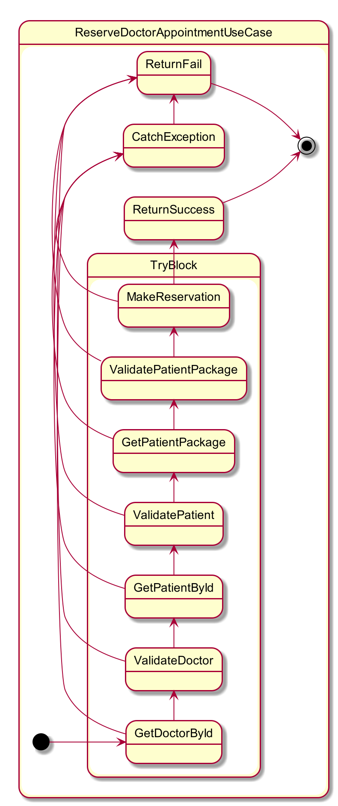
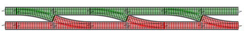
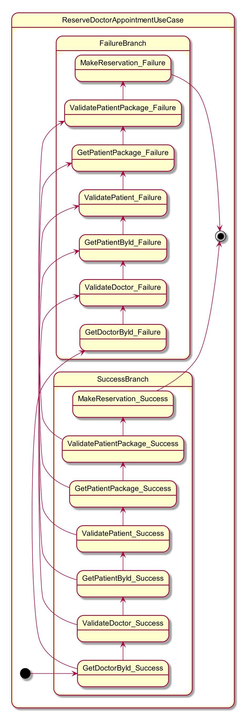
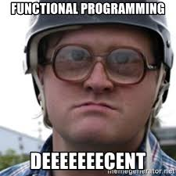

<style>
img[alt~="center"] {
  display: block;
  margin: 0 auto;
}
</style>

# Railway-Oriented Programming

Concept of powerful pattern from functional programming to handle application flow.

---

# Plan of presentation

<br />

> Describing the problem

> Real-life usage

> Pros and cons

> Discussion

---

# Describing the problem

---

# Sample of trivial use case

```csharp
void ReserveDoctorAppointmentUseCase (ReserveDoctorAppointmentCommand command) {
  var doctor = doctorRepository.GetById(command.doctorId);
  var patient = patientRepository.GetById(command.patientId);

  appointmentRepository.MakeReservation(doctor, patient, command.startDate, command.endDate);
}
```

---

# Adding some validations...

```csharp
void ReserveDoctorAppointmentUseCase (ReserveDoctorAppointmentCommand command) {
  var doctor = doctorRepository.GetById(command.doctorId);
  if (doctor != null && doctor.IsActive) {
    var patient = patientRepository.GetById(command.patientId);
  }
  appointmentRepository.MakeReservation(doctor, patient, command.startDate, command.endDate);
}
```

---

# Even more validations...

```csharp
void ReserveDoctorAppointmentUseCase (ReserveDoctorAppointmentCommand command) {
  var doctor = doctorRepository.GetById(command.doctorId);
  if (doctor == null || !doctor.IsActive) {
    return;
  }
  var patient = patientRepository.GetById(command.patientId);
  if (patient == null || !patient.IsActive) {
    return;
  }
  appointmentRepository.MakeReservation(doctor, patient, command.startDate, command.endDate);
}
```

---

# And more validations...

```csharp
void ReserveDoctorAppointmentUseCase (ReserveDoctorAppointmentCommand command) {
  var doctor = doctorRepository.GetById(command.doctorId);
  if (doctor == null || !doctor.IsActive) {
    return;
  }
  var patient = patientRepository.GetById(command.patientId);
  if (patient == null || !patient.IsActive) {
    return;
  }
  var patientPackage = patientPackageRepository.GetByPatient(patient);
  if (patientPackage == null || !patientPackage.CanAppointTo(doctor)) {
    return;
  }
  appointmentRepository.MakeReservation(doctor, patient, command.startDate, command.endDate);
}
```

---

# What if we would like to return status?

```csharp
ReserveDoctorAppointmentStatus ReserveDoctorAppointmentUseCase (ReserveDoctorAppointmentCommand command) {
  var doctor = doctorRepository.GetById(command.doctorId);
  if (doctor == null || !doctor.IsActive) {
    return ReserveDoctorAppointmentStatus.createFailed();
  }
  var patient = patientRepository.GetById(command.patientId);
  if (patient == null || !patient.IsActive) {
    return ReserveDoctorAppointmentStatus.createFailed();
  }
  var patientPackage = patientPackageRepository.GetByPatient(patient);
  if (patientPackage == null || !patientPackage.CanAppointTo(doctor)) {
    return ReserveDoctorAppointmentStatus.createFailed();
  }
  var reservationId = appointmentRepository
      .MakeReservation(doctor, patient, command.startDate, command.endDate);

  return ReserveDoctorAppointmentStatus.createSuccessfull(reservationId);
}
```

---

# What about exceptions?

```csharp
ReserveDoctorAppointmentStatus ReserveDoctorAppointmentUseCase (ReserveDoctorAppointmentCommand command) {
  try {
    var doctor = doctorRepository.GetById(command.doctorId);
    if (doctor == null || !doctor.IsActive) {
      return ReserveDoctorAppointmentStatus.createFailed();
    }
    var patient = patientRepository.GetById(command.patientId);
    if (patient == null || !patient.IsActive) {
      return ReserveDoctorAppointmentStatus.createFailed();
    }
    var patientPackage = patientPackageRepository.GetByPatient(patient);
    if (patientPackage == null || !patientPackage.CanAppointTo(doctor)) {
      return ReserveDoctorAppointmentStatus.createFailed();
    }
    var reservationId = appointmentRepository
        .MakeReservation(doctor, patient, command.startDate, command.endDate);
    return ReserveDoctorAppointmentStatus.createSuccessfull(reservationId);
  }
  catch (Exception ex) {
    return ReserveDoctorAppointmentStatus.createFailed();
  }
}
```

---

# Can't forget about loggging!

```csharp
ReserveDoctorAppointmentStatus ReserveDoctorAppointmentUseCase (ReserveDoctorAppointmentCommand command) {
  try {
    var doctor = doctorRepository.GetById(command.doctorId);
    if (doctor == null || !doctor.IsActive) {
      return ReserveDoctorAppointmentStatus.createFailed();
    }
    var patient = patientRepository.GetById(command.patientId);
    if (patient == null || !patient.IsActive) {
      return ReserveDoctorAppointmentStatus.createFailed();
    }
    var patientPackage = patientPackageRepository.GetByPatient(patient);
    if (patientPackage == null || !patientPackage.CanAppointTo(doctor)) {
      return ReserveDoctorAppointmentStatus.createFailed();
    }
    var reservationId = appointmentRepository
        .MakeReservation(doctor, patient, command.startDate, command.endDate);
    log.LogEvent($"Reserved doctor appointment with ID: {reservationId}")
    return ReserveDoctorAppointmentStatus.createSuccessfull(reservationId);
  }
  catch (Exception ex) {
    logger.LogError("Reserving a doctor appointment failed!", ex);
    return ReserveDoctorAppointmentStatus.createFailed();
  }
}
```

---

# How would process flow look like?



---

# Let's introduce Result type

```fsharp

type Result<'A, 'B> =
    | Ok of ResultValue: 'A
    | Error of ErrorValue: 'B

```

---

# Define two branches in process flow


---

# We could create two track road



---

# `Bind` function

```fsharp

let bind (switchFunction: 'A -> Result<'C -> 'D>) (input: Result<'A, 'B>)
  : Result<'C, 'D> =
  match input with
  | Ok success -> switchFunction success
  | Error failure -> Error failure

```

---

# How would sample use case look like with `Bind` function?

---

# How would process flow look like in ROP?



---

# Real-life usage - Qlib.Environment Project

---

# Discussion

---



